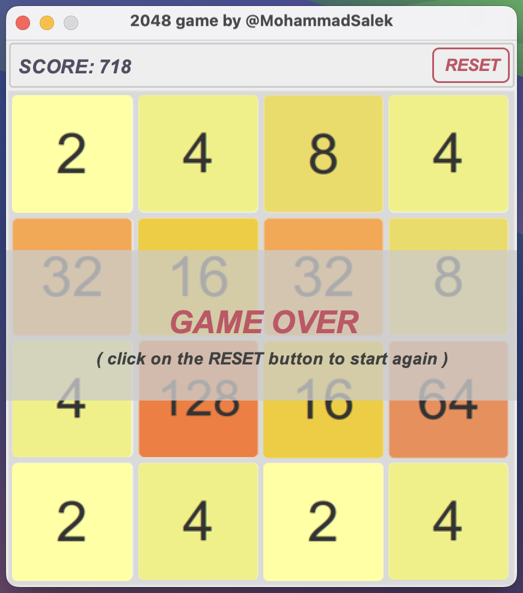

***UPDATE:*** I created this project a long time ago when I was just starting out as a developer. I've held onto these old repositories as a reminder of my early programming experiences. Looking back, I feel a sense of satisfaction and fulfillment, and those memories continue to fuel my passion for programming.

# 2048 Game in Java

The famous 2048 game developed using Java Swing and AWT.

## Getting Started

### Prerequisites

JRE 8 (or later version) installed.

### Installation & Usage

No installation required. You can either download and run the jar file from
[releases](https://github.com/m-salek/2048/releases/) or build the project in your IDE.
Linux: make sure to make the jar file executable (```chmod +x file.jar```)

### Run

`java -jar <jar file>`

## Screenshot



<!-- 

 -->
